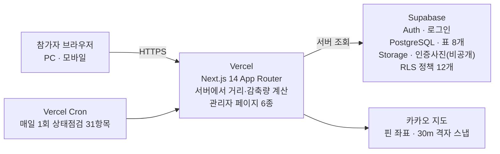

# 그린마일 팜 (Green Mile Farm)

> 시민이 걷기·자전거·대중교통으로 이동한 기록을 인증받으면, 승용차 대비 줄인 CO₂만큼 화면 속 작물이 자라는 웹서비스입니다.
> 광주 지역 환경봉사동아리(G.P.S)의 공모사업 참여자를 대상으로 2026년 여름에 실제로 운영했습니다.
> 인증 심사와 집계를 거쳐 감축량 상위 15명에게 동아리가 직접 키운 작물로 만든 수제청을 배송하는 것으로 종료했습니다.

**서비스** https://green-mile-farm.vercel.app · **상태** 챌린지 종료(2026-08-20)

---

## 목차

- [기간](#기간)
- [운영 성과](#운영-성과)
- [본인과 AI의 역할](#본인과-ai의-역할)
- [시스템 구성](#시스템-구성)
- [보안·개인정보 조치](#보안개인정보-조치)
- [대표 설계 판단](#대표-설계-판단)
- [실행 방법](#실행-방법)
- [환경변수](#환경변수)
- [데이터베이스 마이그레이션](#데이터베이스-마이그레이션)
- [검증 방법](#검증-방법)
- [알려진 한계](#알려진-한계)
- [증빙 링크](#증빙-링크)
- [재사용 조건](#재사용-조건)

---

## 기간

| 구분 | 기간 |
|---|---|
| 개발 | 2026-06-24 ~ 2026-08-20 (커밋 이력 기준 58일) |
| 챌린지 운영 | 2026-07-06 ~ 2026-08-20 (당초 08-02 예정에서 1회 연장) |
| 인증 검토·보상 집행 | 운영기간 중 상시 ~ 마감 후 정산 |
| 자동 상태점검 가동 | 2026-08-07 ~ 2026-08-30 |

## 운영 성과

| 지표 | 값 |
|---|---|
| 가입자 | 47명 |
| 실제 인증 참여자 | 17명 (가입 대비 36.2%) |
| 인증 접수·전수 검토 | 101건 |
| 승인 확정 / 반려 | 66건 / 35건 (반려율 34.7%) |
| 승인 인증 이동거리 | 368.7km (걷기 29건 · 버스 28건 · 자전거 7건 · 지하철 2건) |
| 추정 회피배출량 | 69.41 kgCO₂e — **자체 산정 기준의 추정치입니다. [알려진 한계](#알려진-한계) 참고** |
| 5kg 수확 달성 | 3명 (화면 속 작물 성장 판정 기준) |
| 실물 보상 배송 | 15명 (감축량 상위 15명, 전원 배송 완료) |

> 참여자·감축량·수확 달성자 수치는 서비스 첫 화면의 "함께 만드는 변화" 영역에서 실시간 집계로 확인할 수 있습니다.
> 인증 건수·승인/반려 건수는 개인정보가 포함된 운영 데이터베이스 기준이라 외부에 공개하지 않습니다.

## 본인과 AI의 역할

**이 저장소의 코드 초안은 대부분 생성형 AI가 작성했습니다.** 커밋 34건 전부에 `Co-Authored-By` 표기를 남겨 사실을 기록으로 확인할 수 있게 했습니다.

| 단계 | 본인이 한 것 | AI가 한 것 |
|---|---|---|
| 요구사항 정의 | 무엇을 만들지, 어떤 규칙으로 운영할지, 어떤 데이터를 남길지 결정 | 요구사항을 화면·표·함수 단위로 분해 |
| 설계 판단 | 방식 선택과 **거부**, 되돌릴 수 없는 변경 사전 차단 | 선택지와 장단점 제시 |
| 위험 검토 | 보안·개인정보·데이터 손실 위험 지적, 근거를 코드로 확인하도록 요구 | 지적된 위험의 코드·설정 확인 |
| 구현·검증 | 작업 지시 → 결과 검토 → 직접 써보고 오류 재현 → 수정 요청 → 재확인 | 코드 작성 및 지적 사항 수정 |
| 배포 | 배포 시점 판단 (요청이 있을 때만 배포하도록 규칙화) | 빌드·타입 검사 통과까지만 수행 |
| 운영·검산 | 인증 101건 전수 검토 · 반려 사유 작성 · 보상 대상 선정 · 집계 검산 · 배송 집행 | 점검 자동화 코드·검산 스크립트 작성 |

AI에게 **변경을 금지한 영역**을 따로 지정해 두었습니다 — 지도 핀 좌표 스냅과 거리 계산, 인증 제출·사진검증·촬영정보 처리, 작물 성장 5단계, 통계 집계 방식. 보상이 걸린 계산 로직에서 되돌릴 수 없는 변경이 가장 위험하다고 판단했기 때문입니다.

작업 맥락과 의사결정 근거는 [`HANDOFF.md`](HANDOFF.md)와 [`COWORK_HANDOFF.md`](COWORK_HANDOFF.md)에 남겼습니다. "기능을 고쳐 다시 배포할 때는 인수인계 문서도 함께 갱신한다"는 규칙을 정하고 전용 커밋 8건으로 지켰습니다(커밋 제목 `HANDOFF.md 갱신 —`으로 확인 가능).

## 시스템 구성



| 영역 | 기술 |
|---|---|
| 프런트·서버 | Next.js 14.2.35 (App Router) · React 18 · TypeScript 5 · Tailwind CSS 3.4.1 |
| 데이터베이스 | Supabase (PostgreSQL 17.6, 서울 리전) — 로그인 · DB · 파일저장소 · 행 수준 접근제어(RLS) |
| 외부 API | 카카오 지도(JS·REST) · 다음 우편번호 · exifr(사진 촬영정보 추출) |
| 배포·자동화 | Vercel (main 브랜치 push 시 자동 배포) + Vercel Cron |

**이 구성을 고른 이유** — 운영 인원이 사실상 1명이었습니다. 서버를 직접 두면 장애 대응을 할 수 없으므로, 로그인·데이터베이스·파일저장소·접근제어를 한 곳에서 관리하고 배포가 자동인 조합을 택했습니다. 감축량 계산은 전부 서버에서 수행해 참가자 쪽에서 값을 바꿀 수 없게 했습니다.

### 관리자 페이지 6종

| 경로 | 용도 |
|---|---|
| `/admin` | 통계 — 가입·참여·승인·수확·감축량 집계 |
| `/admin/certifications` | 인증 검토 — 사진 4장·이동 구간·촬영정보 확인 후 승인/반려, 거리 수정 |
| `/admin/participants` | 참가자 명부 — 1인당 집계, 열 정렬, CSV 내려받기(`/admin/export`) |
| `/admin/health` | 상태점검 — 31항목 신호등 표시, 최근 30회 이력 |
| `/admin/content` | 랜딩 내용 — 소개 섹션·고정 문구·이미지 편집 |
| `/admin/settings` | 설정 — 목표 감축량, 챌린지 일정, 배출계수 |

## 보안·개인정보 조치

- **표 8개 전부 RLS(행 수준 보안) 적용, 정책 12개.** 저장소(Storage) 정책 5건은 별도입니다.
  - `certifications` — 본인만 등록·조회, 운영진만 전체 조회·검토. 다른 참가자의 인증은 목록에도 나오지 않습니다.
  - `profiles` — 본인 또는 운영진만 조회, 수정은 운영진만.
  - `certification-photos` 버킷 — **비공개.** 본인 폴더에만 업로드할 수 있고 본인·운영진만 열람합니다.
  - `recovery_attempts` / `password_reset_tokens` — **정책을 아예 두지 않고 `anon`·`authenticated` 권한을 회수**해 서버(service_role)만 접근합니다. 로그인한 사용자도 읽을 수 없습니다.
- **계정 복구는 이메일 링크 방식을 쓰지 않습니다.** 안정적인 메일 발송 수단이 없어 가입 정보 4항목(아이디·이름·휴대폰·이메일) 대조 방식으로 구현했습니다. 안전장치 4가지: ① 4항목 전부 일치해야 통과 ② 10분 내 5회 실패 시 차단 ③ 임시 토큰은 원본 대신 SHA-256 지문만 보관하고 10분 만료·1회용 ④ 운영진(`is_admin`) 계정은 이 경로로 재설정 불가. 실패 시 어느 항목이 틀렸는지 구분하지 않고 항상 같은 문구를 반환합니다.
- **비밀값은 환경변수 6종으로 분리**하고 실제 값이 담긴 파일(`.env*.local`)은 `.gitignore`로 제외했습니다. 커밋 이력 전체를 확인한 결과 비밀값이 올라간 적은 없습니다.
- **수집 개인정보** — 이름(닉네임)·아이디·휴대폰·주소·이메일. 주소·연락처는 보상 배송 목적입니다. 보관기간은 "사업 종료 후 3개월"로 고지했습니다.

## 대표 설계 판단

### 1. 거리 계산 — 경로 탐색을 버리고 직선거리 × 보정계수로 바꿨다

지도 핀 방식으로 바꾼 뒤 직접 테스트하다가, 대학 캠퍼스처럼 큰 단지에서 **같은 출발지·도착지인데 값이 다르게 나오는 것**을 발견했습니다. 경로 탐색이 일방통행·회전 제한을 반영해 A→B와 B→A가 달라진 탓이었습니다.

보상이 걸린 서비스에서 거리는 곧 보상입니다. 정확도를 조금 손해 보더라도 **같은 입력이면 항상 같은 값**이 나오는 편이 낫다고 판단해, 하버사인 직선거리 × 보정계수 1.3으로 바꾸고 계산은 서버에서만 수행하게 했습니다. 함께 핀 좌표를 30m 격자로 스냅해 같은 건물이면 같은 좌표가 되도록 했습니다.

- 코드 [`lib/kakao.ts`](lib/kakao.ts) (`WALK_ROUTE_FACTOR`)
- 커밋 [`1225605`](https://github.com/wndustj1004/green-mile-farm/commit/1225605d6047470f374fb5e7c4ac499ae496e236) → [`65c344e`](https://github.com/wndustj1004/green-mile-farm/commit/65c344e95e3114788f88e2945ad66b92f36c756b) → [`d1c9600`](https://github.com/wndustj1004/green-mile-farm/commit/d1c9600a22fafed8708a56066f1cdc5eea3a09d9)
- 승인 시 운영자가 거리를 수정하면 CO₂가 재계산되고 원래 값·사유·수정자·시각이 남습니다 — [`supabase/10_distance_edit.sql`](supabase/10_distance_edit.sql)

### 2. 집계값을 저장하지 않고 매번 다시 계산한다

누적 감축량과 보너스를 계산해 따로 저장하면 화면은 빨라지지만, 나중에 인증을 반려하거나 이동거리를 수정하면 저장된 값과 실제 기록이 어긋납니다. 갱신을 한 곳이라도 빠뜨리면 조용히 틀린 값이 남고, 참가자 화면과 관리자 명부가 서로 다른 숫자를 보여주게 됩니다.

그래서 **인증 기록 하나만 원본으로 두고 나머지는 매번 다시 계산**하게 했습니다. 보너스도 전용 표를 만들지 않고 `certifications`에서 계산해, 반려·거리 수정이 자동으로 반영되고 중복·누락이 구조적으로 생길 수 없습니다.

함께 **순환 참조**도 차단했습니다. 주간 랭킹 보너스는 목표 달성자를 제외하고 주는데, 보너스가 다시 달성 판정에 들어가면 서로를 참조합니다. 달성 판정에는 인증분만 쓰도록 분리했습니다.

- 코드 [`supabase/12_bonus_awards.sql`](supabase/12_bonus_awards.sql) · [`supabase/13_bonus_steady.sql`](supabase/13_bonus_steady.sql)
- 커밋 [`403995d`](https://github.com/wndustj1004/green-mile-farm/commit/403995d176aaac1285020df7c2ce47b1a807e191)
- 검산 — 인증 35건을 반려한 뒤에도 누적 결과값에서 오류가 나오지 않았고, 명부의 감축량과 대시보드 실효 감축량이 47명 전원 일치함을 대조 확인했습니다.

## 실행 방법

```bash
git clone https://github.com/wndustj1004/green-mile-farm.git
cd green-mile-farm
npm install
cp .env.example .env.local   # 값을 채워 넣습니다
npm run dev                  # http://localhost:3000
```

```bash
npm run build     # 프로덕션 빌드
npm run lint      # ESLint
npx tsc --noEmit  # 타입 검사
```

> Supabase 프로젝트를 새로 만들 경우 [데이터베이스 마이그레이션](#데이터베이스-마이그레이션)을 먼저 실행해야 합니다.
> 카카오 개발자 콘솔에 실행할 도메인(`localhost:3000` 등)을 등록해야 지도가 표시됩니다.

## 환경변수

`.env.example`을 복사해 `.env.local`을 만들고 아래 6종을 채웁니다. 실제 값이 담긴 파일은 커밋되지 않습니다.

| 이름 | 용도 | 노출 범위 |
|---|---|---|
| `NEXT_PUBLIC_SUPABASE_URL` | Supabase 프로젝트 주소 | 브라우저 |
| `NEXT_PUBLIC_SUPABASE_ANON_KEY` | Supabase 공개 키 (RLS로 보호) | 브라우저 |
| `SUPABASE_SERVICE_ROLE_KEY` | 서버 전용 키 — **절대 브라우저에 노출 금지** | 서버 |
| `NEXT_PUBLIC_KAKAO_MAP_KEY` | 카카오 지도 JS 키 | 브라우저 |
| `KAKAO_REST_API_KEY` | 카카오 REST 키 (주소 검색) | 서버 |
| `CRON_SECRET` | 상태점검 API 보호용 Bearer 토큰 | 서버 |

## 데이터베이스 마이그레이션

`supabase/` 폴더의 SQL을 **번호 순서대로** Supabase SQL Editor에서 실행합니다. 코드 배포와는 별개로 수동 실행이 필요합니다.

| 파일 | 내용 |
|---|---|
| `schema.sql` | 표 3개(profiles·certifications·settings), 사진 버킷, RLS 기본 정책, 가입 트리거 |
| `02_admin_review.sql` | 승인/반려 처리 컬럼 |
| `03`~`04` | 랜딩 섹션과 이미지 |
| `05_public_stats.sql` | 공개 집계 함수 `challenge_stats()` |
| `06`~`07` | 주간 랭킹, 감축량 보너스 |
| `08_name_change.sql` | 이름 변경(10일 쿨다운) |
| `09_site_texts.sql` | 메인페이지 고정 문구 편집 |
| `10_distance_edit.sql` | 승인 시 거리 수정과 이력 기록 |
| `11_health_logs.sql` | 상태점검 기록 표 + 읽기 전용 함수 3개 |
| `12`~`13` | 보너스 적립 내역(저장 대신 계산), steady3 보너스 |
| `14_account_recovery.sql` | 계정 복구 표 2개 (RLS 정책 0개 + 권한 회수) |
| `15_bonus_settle_on_end.sql` | 챌린지 마감 후 잔여 보너스 즉시 확정 |

## 검증 방법

**자동화된 단위·통합·E2E 테스트와 CI는 작성하지 않았습니다.** `scripts/` 폴더의 `test-*.mjs` 4개는 자동화 테스트가 아니라 개발 중 수동 확인에 쓴 스크립트입니다. 대신 아래 방식으로 검증했습니다.

| 검증 유형 | 대상과 방법 | 확인된 결과 |
|---|---|---|
| 수동 기능검증 | 가입 → 인증 → 검토 → 집계 전 구간을 실제 사용자 흐름대로 직접 수행 | 같은 구간의 거리 불일치를 발견해 설계 변경 |
| 데이터 검산 | 화면 값과 데이터베이스 재계산 결과 대조 (`scripts/check-bonus.mjs`) | 명부 감축량과 대시보드 실효 감축량 47명 전원 일치 |
| 권한 검증 | 역할별 접근 시도 및 정책·권한 회수 확인 | 계정복구 표 2개가 일반 권한으로 열리지 않음 |
| 회귀 검증 | 반려·거리 수정 전후의 누적 집계값 비교 | 35건 반려 후에도 누적 결과값 오류 없음 |
| 운영 점검 | 무결성·용량·연결 31항목을 하루 1회 자동 실행 | 30회 실행(자동 25) |

### 상태점검 31항목 (`/admin/health`)

- [`lib/health/infra.ts`](lib/health/infra.ts) **A1~A9** — 연결, RPC 3종, Storage 2종, Auth, 환경변수, 배포 버전
- [`lib/health/integrity.ts`](lib/health/integrity.ts) **B1~B14** — 고아 기록, 사진 4장 규칙, DB↔파일 대조, 이상값, 과다 거리, CO₂ 재계산 일치, 집계 일관성, 미검토 방치, 거리 수정 이력, 설정값 유효성, 고아 파일, 랜딩 이미지, 회원 정보, 일정
- [`lib/health/capacity.ts`](lib/health/capacity.ts) **C1~C8** — DB/Storage 용량, 표별 크기, 증가 속도, 응답 추세, 사진 평균 용량, 기록 누적, 전송량 안내

**점검 로직은 데이터를 절대 수정·삭제하지 않습니다.** 유일한 쓰기는 결과 1줄을 `health_logs`에 기록하는 것뿐입니다([`lib/health/run.ts`](lib/health/run.ts)). 임계값은 [`lib/health/types.ts`](lib/health/types.ts)의 `TH` 상수 한 곳에 모여 있습니다.

## 알려진 한계

1. **CO₂ 배출계수는 공식 확정 계수가 아닙니다.** 현재 값(승용차 211.1 / 걷기 0 / 자전거 0 / 버스 29.1 / 지하철 1.53 g/km)은 운영자가 화면에서 변경할 수 있는 자체 설정값이며, [`supabase/schema.sql`](supabase/schema.sql)의 `settings` 표 주석에 "임시값 — 공식값 확정 시 교체"로 명시돼 있습니다. **69.41 kgCO₂e는 승용차 대체를 전제한 추정 회피배출량이며, 공식 정책 성과지표로 그대로 사용할 수 없습니다.**
2. **보정계수 1.3은 실측이 아닌 근사값**이라 실제 이동거리와 차이가 납니다.
3. **계수를 바꾸기 전에 등록된 인증 15건은 당시 값을 유지합니다.** 과거 기록을 소급 재계산하지 않는 것이 원칙이며, 점검 B6이 이를 "정상 이력"으로 표시합니다.
4. **자동화 테스트와 CI가 없습니다.** 운영 규모(참여 17명·인증 101건)에서는 전수 육안 검토가 가능했지만 규모가 커지면 통하지 않습니다. 감축량 계산 로직과 권한 경계에 자동 테스트를 붙이는 것이 다음 과제입니다.
5. **참여 이탈 원인을 조사하지 않았습니다.** 가입 47명 중 인증까지 한 사람은 17명(36.2%)인데, 이탈자 대상 조사를 하지 않아 원인은 가설 단계입니다(가입 단계의 배송지 요구, 인증 1건당 사진 4장 + 지도 핀 2회, 임시저장 부재 등).
6. **인증의 신뢰성에 절대 기준이 없습니다.** 사진에서 촬영시각·위치를 추출하지만 지도 앱 스크린샷에는 그 정보가 없습니다. 지도 핀·사진 4장·사후 검토를 겹쳐 보완했고, 반려 35건이 그 흔적입니다.
7. **상태점검이 찾아낸 미해결 항목 2건** — 어떤 인증에도 연결되지 않은 사진 파일 16건(약 13.3MB, 동작에는 무해), CO₂ 재계산 불일치 15건(위 3번의 정상 이력이라 조치 불필요).
8. **챌린지가 종료됐지만 신규 회원가입과 배송지 수집 경로가 아직 열려 있습니다.** 목적을 달성한 개인정보의 수집 중지와 파기 절차를 서비스에 반영하는 것이 남은 과제입니다. 보관기간(사업 종료 후 3개월) 기준 파기 예정일은 2026-11-20경이며, **아직 파기하지 않았습니다.**
9. `LandingSections`의 섹션 2·3은 인덱스 고정 매핑이라 관리자 화면에서 섹션 순서를 바꾸면 표시가 깨질 수 있습니다.
10. Vercel Hobby 플랜 제약으로 Cron은 하루 1회·시각 ±59분·실패 시 재시도가 없습니다. 월 전송량(Egress)은 Supabase 서버 통계라 앱에서 읽을 수 없어 C8이 대시보드 링크로 안내만 합니다.

## 증빙 링크

| 확인 항목 | 위치 |
|---|---|
| 커밋 34건 · 개발 기간 | [Commit History](https://github.com/wndustj1004/green-mile-farm/commits/main) |
| AI 공동작업 표기 | [`fb9aad4`](https://github.com/wndustj1004/green-mile-farm/commit/fb9aad4b6eb2cc26ab123be09ab88452c4d731b1) · [`f24fccb`](https://github.com/wndustj1004/green-mile-farm/commit/f24fccb00d5db9433a64aac92546a1f62f95fda8) (각 커밋 하단 Co-authored-by) |
| 표 8개 · RLS 정책 12개 | [`supabase/schema.sql`](supabase/schema.sql) · [`supabase/14_account_recovery.sql`](supabase/14_account_recovery.sql) |
| 거리 계산 설계 | [`lib/kakao.ts`](lib/kakao.ts) · 커밋 [`d1c9600`](https://github.com/wndustj1004/green-mile-farm/commit/d1c9600a22fafed8708a56066f1cdc5eea3a09d9) |
| 집계값 미저장·순환참조 차단 | [`supabase/12_bonus_awards.sql`](supabase/12_bonus_awards.sql) · 커밋 [`403995d`](https://github.com/wndustj1004/green-mile-farm/commit/403995d176aaac1285020df7c2ce47b1a807e191) |
| 상태점검 31항목 | [`lib/health/integrity.ts`](lib/health/integrity.ts) · [`vercel.json`](vercel.json) |
| CO₂ 산정 기준 | [`supabase/schema.sql`](supabase/schema.sql) `settings` 표 주석 |
| 작업 기록 | [`HANDOFF.md`](HANDOFF.md) · [`COWORK_HANDOFF.md`](COWORK_HANDOFF.md) |
| 서비스 결과 | https://green-mile-farm.vercel.app (첫 화면 "함께 만드는 변화") |

## 재사용 조건

별도의 오픈소스 라이선스를 지정하지 않았습니다. 포트폴리오·심사 목적의 열람용으로 공개하며, 코드 재사용이 필요하면 저장소 소유자에게 문의해 주세요.

참가자 개인정보는 이 저장소에 포함되어 있지 않습니다. 스키마와 코드만 공개하며, 운영 데이터는 Supabase 프로젝트에만 존재합니다.
